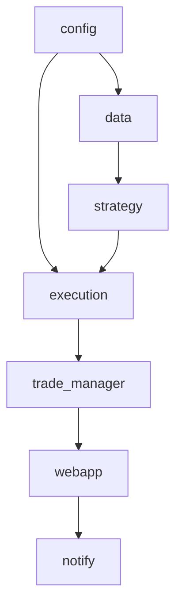

# Bot de Trading

Este repositorio contiene un bot de trading de criptomonedas que obtiene datos de mercado desde Binance y ejecuta órdenes en Bitget.
Además soporta la conexión con otros exchanges opcionalmente y dispone de un pequeño panel web para monitorear las operaciones en tiempo real. También pueden enviarse avisos por Telegram y Discord.

## Funcionalidades

- Indicadores técnicos avanzados (RSI, MACD, ATR) con soporte opcional de [TA-Lib](https://ta-lib.org) y soportes/resistencias mediante extremos locales (requiere `scipy`)
- Parámetros de gestión de riesgo
- Tamaño de posición calculado según porcentaje de balance disponible y distancia al stop

- Stop-loss y take-profit con límite diario de pérdidas
- Filtrado de símbolos y ajuste de apalancamiento
- Verificación del apalancamiento aplicado en Bitget tras la configuración
- Ejecución de órdenes en varios exchanges mediante `ccxt`
- Tipos de orden avanzados (market, limit, stop)
- Selección de trades priorizando la mayor probabilidad con ratio beneficio/riesgo >= 2:1
- Panel web accesible directamente en `http://localhost:8000` para monitoreo en
  tiempo real. Los datos de operaciones se consultan desde el endpoint
  `/api/trades`
- La plantilla HTML del dashboard se encuentra en `trading_bot/templates/index.html` para facilitar su personalizacion.
- Si Flask no está instalado, intentar iniciar el dashboard lanzará un `ImportError`.
- Las operaciones abiertas se registran en `trade_manager` y el dashboard las
  obtiene directamente desde ahí. Cada operación muestra en la tabla su PnL no
  realizado calculado con el precio actual
- Notificaciones por Telegram y Discord al abrir y cerrar operaciones
- Arquitectura modular para facilitar mejoras
- Métricas de Prometheus disponibles en `http://localhost:8001/metrics`
- Análisis del libro de órdenes para zonas de liquidez
- Los símbolos en el dashboard de liquidez muestran la fuente, p.ej.
  `BTC_USDT (Binance)` o `BTC_USDT (Bitget)`
 - La lista de símbolos que analiza el bot se obtiene de forma dinámica según el
  volumen de futuros USDT del exchange. En `TEST_MODE` se usa `MockExchange`,
  que genera 25 pares con volúmenes deterministas para devolver siempre los 15
  más líquidos.
- Sentimiento de mercado usando el ratio de posiciones long/short de Bitget
- Reconciliación automática con posiciones de Bitget al iniciar
- Cancelación de órdenes pendientes no registradas al sincronizar

- Cancelación automática de órdenes límite que exceden cierta antigüedad
- Verificación de balance y llenado de órdenes con registro de slippage
- Historial persistente de operaciones en `trade_history.csv` y archivos JSON
- Endpoints públicos de Binance para ticker, libro de órdenes y velas
- Flujo en tiempo real del order book por `wss://fstream.binance.com`
- Los WebSocket se inician explícitamente con `strategy.start_liquidity()` para evitar conexiones al importar módulos. Sin pasar símbolos se conectará automáticamente a los 15 pares de mayor volumen
- Modelos de machine learning optimizados con `trading_bot.optimizer`
- Entrenamiento de modelos con `python -m trading_bot.train_model`
- Exchange simulado para pruebas sin conexión a Bitget
- Motor de backtesting con `python -m trading_bot.backtest`

## Uso

Instala las dependencias y pon en marcha el bot:

```bash
pip install -r requirements.txt
python -m trading_bot.bot
python -m trading_bot.backtest
python -m trading_bot.train_model miarchivo.csv --target result
```

### Panel web y sincronización con el bot

El dashboard ahora funciona sin microservicios adicionales: basta con arrancar
el bot para servir tanto la API como la página web en el puerto `8000`.

1. Inicia el bot con `python -m trading_bot.bot`.
2. Abre `http://localhost:8000` en el navegador para ver el dashboard.

La página usa los endpoints del propio bot (`/api/*` y WebSocket) por lo que no
es necesario configurar gateways ni Docker Compose.

Los antiguos envoltorios `run_backtest.py` (cargaba `backtest.yml` + `backtest.csv`
y ejecutaba el motor) y `train_predictive_model.py` (envoltorio CLI sobre
`trading_bot.predictive_model`) se eliminaron para evitar duplicar lógica de
línea de comandos. Utiliza directamente los módulos `trading_bot.backtest` y
`trading_bot.train_model`, que exponen las mismas interfaces desde un único
punto de mantenimiento.

`get_market_data` obtiene hasta 500 velas por defecto usando el endpoint
`/fapi/v1/klines` de Binance. Puedes ajustar el parámetro `limit` (1‑1000)
para cargar más o menos historial. Las velas descargadas se guardan en
`cache/` para poder realizar análisis en modo offline si la API no está
disponible.

### Variables de entorno

Las credenciales de API y el comportamiento del bot se controlan mediante las
variables definidas en `trading_bot/config.py`:

- `BITGET_API_KEY`, `BITGET_API_SECRET`, `BITGET_PASSPHRASE`
- `BINANCE_API_KEY`, `BINANCE_API_SECRET`
- `TRADING_MODE` (`live` por defecto; usa `paper` o `testnet` para desactivar envíos reales)
- `ALLOW_LIVE_TRADING` (`1` por defecto; ponlo a `0` para bloquear cualquier orden real incluso en modo `live`)
- `DEFAULT_EXCHANGE` (default `bitget`)
- `TELEGRAM_TOKEN` / `TELEGRAM_CHAT_ID`
- `DISCORD_WEBHOOK`
- `MAX_OPEN_TRADES` (default 10)
- `DAILY_RISK_LIMIT` (default `-50`)
- `TEST_MODE` set to `1` to use a mock exchange without sending real orders

- `TEST_SYMBOLS` comma separated list of symbols to analyse when `TEST_MODE` is
  enabled
- `MODEL_PATH` path to saved ML model (default `model.pkl`)
- `MODEL_SEQ_PATH` ruta al modelo secuencial (Keras/PyTorch) usado para
  procesar ventanas de velas con forma `(1, N, 4)` en el orden
  `[close, high, low, volume]`
- `MODEL_SEQ_WEIGHT` peso del modelo secuencial al mezclar probabilidades
  (default `0.2`)
- `MODEL_SEQ_WINDOW` número de velas usadas para construir la secuencia normalizada
  (default `64`)
- `MODEL_SEQ_INTERVAL` intervalo de las velas solicitadas para alimentar el
  modelo secuencial (default `Min5`)
- `STOP_ATR_MULT` ATR multiple for stop loss (default `1.5`)
- `TRAILING_ATR_MULT` multiplicador ATR para el trailing stop estilo Chandelier
  Exit (default `3.0`)
- `TRAILING_ATR_PERIOD` período del ATR usado para el trailing stop (default `14`)
- `RSI_PERIOD` período del RSI (default `14`)
- `MIN_RISK_REWARD` ratio mínimo beneficio/riesgo para abrir (default `2.0`, `1.3` en modo test)
- `DEFAULT_LEVERAGE` apalancamiento por defecto (default `10`)
- `MIN_POSITION_SIZE` tamaño mínimo de posición permitido (default `0.001`, `1e-4` en modo test)
- `RISK_PER_TRADE` cantidad fija en USDT o porcentaje del balance a arriesgar por trade. Si es menor que 1 se interpreta como porcentaje (default `0.01`, es decir 1% del saldo)
- `ORDER_FILL_TIMEOUT` seconds to wait before canceling unfilled limit orders (default `120`)

- `ENABLE_TRADE_HISTORY_LOG` activa el registro detallado de cambios en memoria (default `0`)
- `MAX_TRADE_HISTORY_SIZE` número máximo de eventos en memoria antes de descartar los más antiguos (default `1000`)
- `MAX_CLOSED_TRADES` número máximo de operaciones cerradas que se mantienen en memoria antes de purgar las más antiguas (default `2000`)
- `MAX_TRADES_PER_SYMBOL` límite de operaciones simultáneas por par (default `1`)
- `COOLDOWN_MINUTES` minutos de espera tras cerrar una operación antes de volver a operar el mismo par (default `2`)

### Agente de Reinforcement Learning (RL)

El ajuste dinámico de `take profit` y `stop loss` se controla con las siguientes
variables. El agente se mantiene inactivo salvo que `RL_AGENT_ENABLED=1`.

```env
RL_AGENT_ENABLED=1          # Activa el agente RL (0 para desactivarlo)
RL_ALGO=ppo                 # Algoritmo: 'ppo' (por defecto) o 'dqn'
RL_POLICY_PATH=models/rl_policy.zip
RL_BUFFER_CAPACITY=400      # Muestras máximas en memoria
RL_LEARN_INTERVAL=20        # Cada cuántas muestras entrenar
RL_MIN_TRAINING_SAMPLES=25  # Muestras mínimas antes de aprender
RL_LEARN_STEPS=500          # Pasos de entrenamiento por sesión
RL_TP_MULT_MIN=0.8          # Límite inferior multiplicador TP
RL_TP_MULT_MAX=2.5          # Límite superior multiplicador TP
RL_SL_MULT_MIN=0.8          # Límite inferior multiplicador SL
RL_SL_MULT_MAX=2.0          # Límite superior multiplicador SL
RL_DISCRETE_TP_BINS=4       # Bins discretos de TP al usar DQN
RL_DISCRETE_SL_BINS=3       # Bins discretos de SL al usar DQN
RL_PERSIST_AFTER_TRADE=true # Guardar política tras cada trade
RL_MAX_TP_PCT=0.5           # Máximo TP relativo al precio de entrada
RL_MAX_STOP_LOSS_PCT=1.0    # Máximo SL relativo al precio de entrada
```

Cuando está habilitado, el módulo `trading_bot.rl_agent` calcula multiplicadores
para TP/SL basados en las características de la señal y registra los resultados
de cada trade para seguir entrenando la política. Si está desactivado, el bot
usa únicamente las heurísticas tradicionales.

Los modelos secuenciales deben entrenarse con tensores de entrada de forma
`(batch, N, 4)` siguiendo el orden `[close, high, low, volume]`. Durante la
inferencia se aplica normalización *z-score* por característica sobre la misma
ventana de longitud `N` (media y desviación estándar de cada columna, con un
epsilon para evitar divisiones por cero); replica ese preprocesado en los
pipelines de entrenamiento para asegurar que los datos en vivo tienen la misma
escala. Puedes generar un modelo básico LSTM con TensorFlow/Keras usando el
CLI incluido:

```bash
python -m trading_bot.sequence_trainer trades.csv --target is_profitable \
  --window 64 --output models/model_seq.keras
```

El comando anterior construye ventanas deslizantes de 64 velas con las columnas
`close`, `high`, `low` y `vol`, entrena un clasificador binario y guarda el
modelo listo para ser cargado mediante `MODEL_SEQ_PATH`.

- `ORDER_MAX_AGE` seconds after which pending orders are automatically cancelled (default `120`)
- `MAX_SLIPPAGE` maximum allowed difference between target and execution price when closing a trade (default `0.01`)
- `WEBAPP_HOST` dashboard host (default `0.0.0.0`)
  - `WEBAPP_PORT` dashboard port (default `8000`)

Copia `.env.example` a `.env` y rellena tus claves API para comenzar. El bot
cargará automáticamente ese archivo al iniciarse.

## Auto-Training y filtro de ruido

El bot puede registrar automáticamente operaciones cerradas para re-entrenar el
modelo predictivo en caliente. Para activarlo:

1. Ajusta tu `.env` con los nuevos parámetros:

   ```env
   ENABLE_MODEL=1
   AUTO_TRAIN_ENABLED=1
   AUTO_TRAIN_POLL_SECONDS=30
   MIN_TRAIN_SAMPLE_SIZE=100
   RETRAIN_INTERVAL_TRADES=50
   DATASET_PATH=./data/auto_train_data.csv
   MODEL_DIR=./models
   POST_DEPLOY_MIN_SAMPLES=50
   POST_DEPLOY_MIN_HIT_RATE=0.52
   POST_DEPLOY_MAX_DRIFT=0.08
   NOISE_FILTER_METHOD=ema
   NOISE_FILTER_SPAN=12
   VOL_HIGH_TH=0.015
   VOL_MARGIN_BPS=10
   ```

2. Cada cierre de trade del bot añade una fila etiquetada en `DATASET_PATH` usando un
   *file lock* para evitar corrupciones. El hilo `auto_trainer` valida el
   esquema (con winsorization ligera) antes de entrenar y usa *class
   weighting* balanceado. El repositorio incluye un dataset semilla en
   `data/auto_train_data.csv` con 60 ejemplos para que el primer entrenamiento
   pueda ejecutarse nada más arrancar.

3. Cuando hay suficientes muestras, el modelo se entrena de nuevo. Si supera
   los umbrales offline (`MODEL_MIN_WIN_RATE` y `MODEL_MAX_CALIBRATION_DRIFT`),
   se despliega con swap atómico escribiendo primero `model.pkl.tmp` y luego
   `os.replace`. Cada versión se guarda como `models/model-YYYYMMDD_HHMMSS.pkl`
   y el symlink `models/latest` apunta al modelo activo.

4. Tras desplegar, el bot monitorea una ventana corta de operaciones vivas. Si
   el `MODEL_MONITOR` detecta que el hit-rate cae por debajo de los mínimos o
   el *drift* excede el umbral, se hace **rollback** inmediato al artefacto
   `good_model.pkl` sin interrumpir el proceso.

5. Las nuevas métricas Prometheus (`auto_train_last_duration_seconds`,
   `auto_train_last_status`, `auto_train_samples_total`, `model_version_info`)
   permiten vigilar el pipeline de entrenamiento en Grafana/Alertmanager.

El filtro de ruido aplica un suavizado configurable (EMA o mediana) antes de
calcular indicadores y aumenta automáticamente el umbral de probabilidad cuando
la volatilidad (ATR/precio) supera `VOL_HIGH_TH`. Ajusta `VOL_MARGIN_BPS` para
controlar el margen adicional expresado en *basis points*.
## Dependencias opcionales

Para acelerar el cálculo de indicadores se puede instalar [TA-Lib](https://ta-lib.org).
La detección de soportes y resistencias utiliza `scipy`; si estas bibliotecas no están disponibles, se usarán implementaciones en Python puro.


## Configuración avanzada

| Variable | Descripción | Por defecto |
|----------------------|-------------------------------------------------------------------------------|------------|
| `LOG_LEVEL` | Nivel de verbosidad del log (`DEBUG`, `INFO`, `WARNING`, `ERROR`). | `INFO` |
| `DATA_RETRY_ATTEMPTS`| Número de reintentos al descargar datos antes de usar la caché. | `3` |
| `ORDER_SUBMIT_ATTEMPTS` | Reintentos al enviar o cerrar órdenes. | `3` |
| `TRADE_COOLDOWN` | Tiempo en segundos que debe transcurrir antes de reabrir el mismo símbolo (derivado de `COOLDOWN_MINUTES` si no se especifica). | `120` |
| `MAX_CONCURRENT_REQUESTS` | Número máximo de llamadas simultáneas al exchange. | `5` |
| `CPU_THRESHOLD` | Fracción de uso de CPU a partir de la cual se enviará una alerta (0–1). | `0.8` |
| `MEMORY_THRESHOLD_MB` | Uso de memoria en MB que dispara una alerta. | `500` |
| `LATENCY_THRESHOLD_MS` | Latencia (en milisegundos) considerada excesiva para llamadas de API. | `1000` |

Las métricas del bot se exponen por defecto en `http://localhost:8001/metrics`. Pueden configurarse alertas de uso de CPU y memoria mediante las variables de entorno anteriores.



## Production hardening

El bot incluye utilidades pensadas para operar en producción con resiliencia:


### Selector de modo de arranque

* Ejecuta `python -m trading_bot.bot --mode {normal,shadow,heuristic,hybrid,testnet,backtest,maintenance}` para seleccionar el comportamiento en CLI.
* Alternativamente define `BOT_MODE` en el entorno; si no hay bandera ni variable y existe TTY, se mostrará un menú interactivo.
* Las banderas aplican sobre los knobs existentes (`ENABLE_TRADING`, `SHADOW_MODE`, `ENABLE_MODEL`, etc.) sin romper la compatibilidad.

| Modo | Descripción | Efectos principales |
| --- | --- | --- |
| `normal` / `hybrid` | Trading real combinando heurística + modelo | `ENABLE_TRADING=1`, `ENABLE_MODEL=1` |
| `heuristic` | Solo heurística (modelo deshabilitado) | `ENABLE_TRADING=1`, `ENABLE_MODEL=0`, `MODEL_WEIGHT=0.0` |
| `shadow` | Shadow-mode A/B sin enviar órdenes reales | `ENABLE_TRADING=0`, `SHADOW_MODE=1` |
| `testnet` | Dry-run o testnet con envío simulado | `ENABLE_TRADING=1`, `DRY_RUN=1` |
| `backtest` | Ejecuta el runner de backtest al arrancar y termina | `RUN_BACKTEST_ON_START=1` |
| `maintenance` | Mantiene métricas sin abrir nuevas operaciones | `ENABLE_TRADING=0`, `MAINTENANCE=1` |


### Backtest walk-forward

* Ejecuta `python -m trading_bot.backtest --config backtest.yml --data dataset.csv` para generar reportes en `reports/backtest_*` con KPIs económicos (CAGR, Sharpe, Max Drawdown, Profit Factor, Expectancy).
* El modo `walk_forward` amplía progresivamente la ventana de entrenamiento, mientras que `rolling` usa una ventana móvil (`rolling_train_days` / `rolling_test_days`).
* Los reportes contienen `kpis.json`, `trades.csv` y `config.json` para auditar cada corrida.

### Shadow-mode

* Actívalo con `SHADOW_MODE=1` para comparar heurística vs. blending ML sin enviar órdenes reales.
* Los resultados se almacenan en `shadow_trades/` (`signals.jsonl`, `results.jsonl`) y permiten calcular KPIs de ambos enfoques antes de desplegar.
* Para ejecutar shadow con tamaño fijo y datos exclusivos de Bitget configura tu `.env` con:
  * `BOT_MODE=shadow`, `ENABLE_TRADING=false`, `DRY_RUN=true`.
  * `USE_FIXED_POSITION_SIZE=true`, `FIXED_POSITION_SIZE_USDT=20`, `MIN_POSITION_SIZE_USDT=5`, `ENFORCE_EXCHANGE_MIN_NOTIONAL=false`.
  * `PRIMARY_EXCHANGE=bitget`, `DATA_EXCHANGE=bitget`, `WS_EXCHANGE=bitget`, `ENABLE_BITGET=true`, `ENABLE_BINANCE=false`.

### Latencia y alertas

* Las métricas `trading_bot_latency_ms_*` exponen p95/p99 de feature→predicción, submit→ack y ack→filled.
* `maybe_alert` envía avisos a Telegram/Discord cuando se superan umbrales de pérdida diaria, latencia o drift del modelo.

### Apagado limpio

* El manejador de señales (`trading_bot.shutdown`) detiene nuevas entradas, cancela órdenes pendientes y guarda el estado antes de finalizar el proceso.

### Nuevas variables de entorno

| Variable | Descripción | Por defecto |
| --- | --- | --- |
| `MODEL_WEIGHT` | Peso del modelo predictivo en el blending (0–1). | `0.5` |
| `MIN_PROB_SUCCESS` | Probabilidad mínima aceptada tras fees y blending. | `0.55` |
| `FEE_EST` | Estimación de fees+slippage para los filtros de probabilidad. | `0.0006` |
| `SHADOW_MODE` | Si es `1`, habilita el modo sombra (sin órdenes reales). | `0` |

| `BOT_MODE` | Define el modo de arranque si no se pasa `--mode`. | _vacío_ |
| `DRY_RUN` | Fuerza el envío simulado de órdenes. | `0` |
| `BACKTEST_REPORT_DIR` | Carpeta raíz donde se guardan los reportes de backtest. | `reports` |
| `BACKTEST_CONFIG_PATH` / `BACKTEST_DATA_PATH` | Rutas usadas al iniciar en modo `backtest`. | `backtest.yml` / `backtest.csv` |

| `MAX_API_RETRIES` | Reintentos máximos al contactar con el exchange. | `5` |
| `API_BACKOFF_BASE` | Backoff base (segundos) para reintentos exponenciales. | `0.2` |
| `LATENCY_SLO_MS` | Límite de latencia (ms) que dispara alertas automáticas. | `1000` |
| `RSI_OVERSOLD` / `RSI_OVERBOUGHT` | Banda de RSI configurable para la heurística. | `45` / `55` |

## Pruebas

Para ejecutar todas las pruebas y ver el reporte de cobertura ejecuta:

```bash
pytest
```


## Licencia

Este proyecto se distribuye bajo la licencia MIT. Consulta el archivo [LICENSE](LICENSE) para más informacion.


## Arquitectura simplificada

El dashboard vuelve a ejecutarse de forma monolítica dentro del bot, sin
microservicios ni orquestación con Docker Compose. Todos los endpoints de datos
y el HTML del panel viven en `trading_bot/webapp.py`, por lo que basta con
mantener las dependencias de `requirements.txt` instaladas para trabajar en
local.
